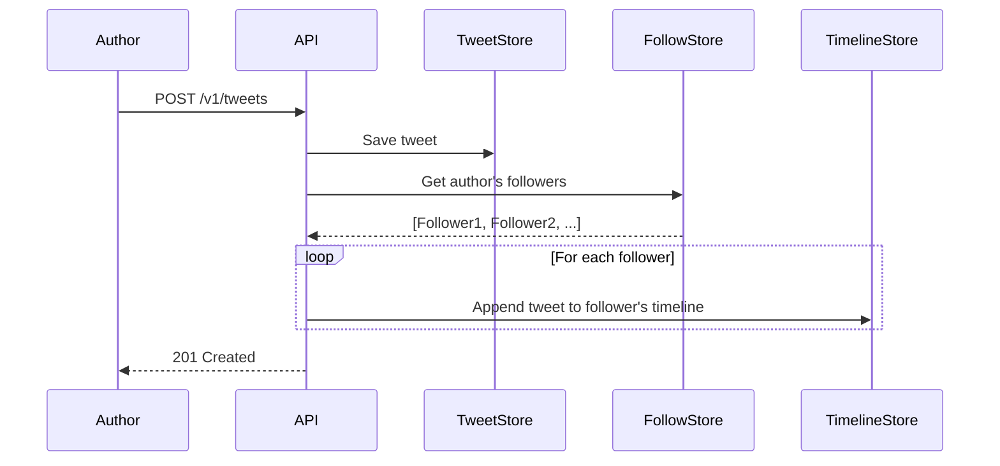
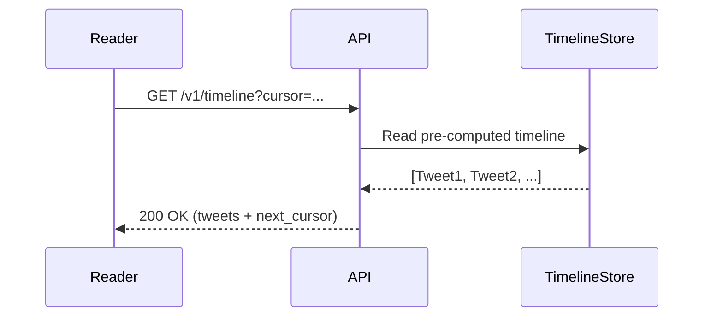
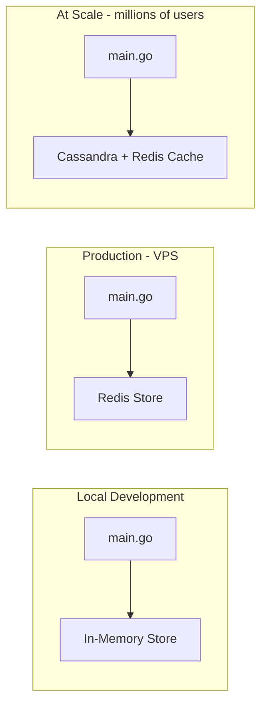
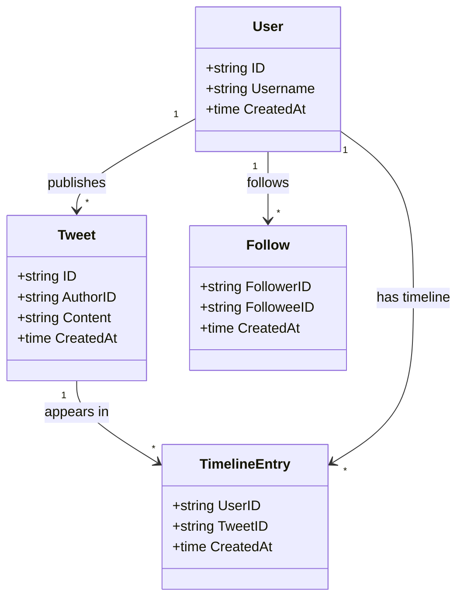

# Twix - Microblogging Platform

A simplified microblogging platform similar to Twitter/X. The name **Twix** comes from
the combination of **Twi**tter and **X**. Users can publish tweets, follow other users,
and view a timeline of tweets from the people they follow.

## API Design

User identification is handled via the `X-User-ID` header on every request.

| Method | Route | Description |
|--------|-------|-------------|
| `POST` | `/v1/users` | Create a new user |
| `POST` | `/v1/tweets` | Publish a tweet (max 280 chars) |
| `GET` | `/v1/tweets/:id` | Get a single tweet by ID |
| `POST` | `/v1/users/:id/follow` | Follow a user |
| `DELETE` | `/v1/users/:id/follow` | Unfollow a user |
| `GET` | `/v1/timeline` | Get the authenticated user's timeline |

### Timeline Pagination

The timeline uses **cursor-based pagination** for consistency under concurrent writes.

```
GET /v1/timeline?cursor=2024-01-15T10:30:00Z&limit=20
```

- `cursor`: Timestamp of the last tweet seen (omit for the first page).
- `limit`: Number of tweets to return (default: 20).

The response includes a `next_cursor` field to fetch the next page.

**Why cursor-based over offset?** Offset pagination (`OFFSET 40 LIMIT 20`) breaks when new
tweets are inserted between page requests — items shift and users see duplicates or miss
tweets. Cursor-based pagination is anchored to a specific point in time, making it stable
regardless of concurrent writes.

## Timeline Strategy: Fan-Out on Write

The system is **optimized for reads**. When a user publishes a tweet, it is written to
the pre-computed timeline of every follower. Reading the timeline becomes a simple lookup
instead of an expensive join.





### Trade-offs

| | Fan-Out on Write | Fan-Out on Read |
|---|---|---|
| **Write cost** | O(N) where N = number of followers | O(1) |
| **Read cost** | O(1) — direct lookup | O(N) — join followers + tweets at read time |
| **Best for** | Read-heavy workloads | Write-heavy workloads |
| **Chosen?** | Yes | No |

For a celebrity with millions of followers, fan-out on write becomes expensive.
A hybrid approach could be used: fan-out on write for regular users, fan-out on read
for celebrities. This optimization is noted but not implemented.

## Storage Strategy

The application uses dependency injection to swap storage implementations per environment.



### Why each storage engine?

| Engine | Use Case | Reason |
|--------|----------|--------|
| **In-Memory** | Local development & testing | Zero dependencies, fast iteration |
| **Redis** | Production (VPS) | Sorted Sets are a natural fit for timelines (`ZREVRANGE`). Simple to operate on a single VPS node without the overhead of a full database cluster |
| **Cassandra** | At scale (millions of users) | Horizontal scaling, partition-per-user model for timelines, sequential disk reads. Designed for exactly this access pattern |

Redis Sorted Sets for timelines:
- **Key**: `timeline:{userID}`
- **Score**: Tweet timestamp (Unix nano)
- **Member**: Tweet ID
- Reading timeline = `ZREVRANGEBYSCORE` with cursor = last seen timestamp

## Data Model



## Architecture Overview

The project follows **Package Oriented Design** (Bill Kennedy style) with layered
architecture. Each domain package defines its own interfaces (ports) and business logic.
Infrastructure implementations live in a separate `platform` package. Every layer
communicates with the next through interfaces — no layer is coupled to another's
implementation. Handlers depend on service interfaces, services depend on store
interfaces, and concrete implementations satisfy those contracts.

### Layer Responsibilities

| Layer | Package | Responsibility |
|-------|---------|---------------|
| **Entry Point** | `cmd/api` | Bootstrap the app, wire dependencies, route registration, start HTTP server |
| **Handlers** | `cmd/api/internal/handlers` | HTTP handlers (app-level, not infrastructure) |
| **Business Logic** | `internal/tweet`, `follow`, `timeline` | Domain rules, validation, orchestration. Each package defines its own Store interface |
| **Infrastructure** | `internal/platform/web` | Middleware and response helpers |
| **Storage Implementation** | `internal/platform/storage/*` | Concrete implementations (in-memory, Redis) |

## Project Structure

```
twix/
├── cmd/
│   └── api/
│       ├── main.go                     # Bootstrap, DI, route registration, server start
│       ├── internal/
│       │   └── handlers/               # HTTP handlers (app-level)
│       │       ├── userhdl.go
│       │       ├── tweethdl.go
│       │       ├── followhdl.go
│       │       └── timelinehdl.go
│       └── tests/
│           └── integration_test.go     # Integration tests (full HTTP flow)
├── internal/
│   ├── tweet/
│   │   ├── model.go                    # Tweet entity
│   │   ├── tweet.go                    # Store interface + Service
│   │   └── tweet_test.go              # Unit tests
│   ├── user/
│   │   ├── model.go                    # User entity
│   │   ├── user.go                     # Store interface + Service
│   │   └── user_test.go
│   ├── follow/
│   │   ├── model.go                    # Follow entity
│   │   ├── follow.go                   # Store interface + Service
│   │   └── follow_test.go
│   ├── timeline/
│   │   ├── timeline.go                 # Store interface + Service (fan-out orchestration)
│   │   └── timeline_test.go
│   └── platform/
│       ├── web/                        # Middleware, response helpers (infrastructure only)
│       ├── storage/
│       │   ├── memory/                 # In-memory implementations
│       │   └── redis/                  # Redis implementations
│       └── config/                     # Environment-based configuration
├── business.txt                        # Business assumptions
├── README.md                           # This file
└── go.mod
```

## Testing Strategy

- **Unit tests**: In every domain package (`tweet_test.go`, `follow_test.go`, etc.).
  Test business rules in isolation using the in-memory store.
- **Integration tests**: In `cmd/api/tests/integration_test.go`.
  Spin up real dependencies (Redis, etc.) in containers using `testcontainers-go`.
  Make real HTTP requests against the full stack with no mocks.
  Cover the main use cases end-to-end: publish a tweet, follow a user, read timeline.

## Running the Project

```bash
# Local development (in-memory storage)
go run ./cmd/api

# Production (Redis)
TWIX_ENV=production REDIS_URL=localhost:6379 go run ./cmd/api
```
